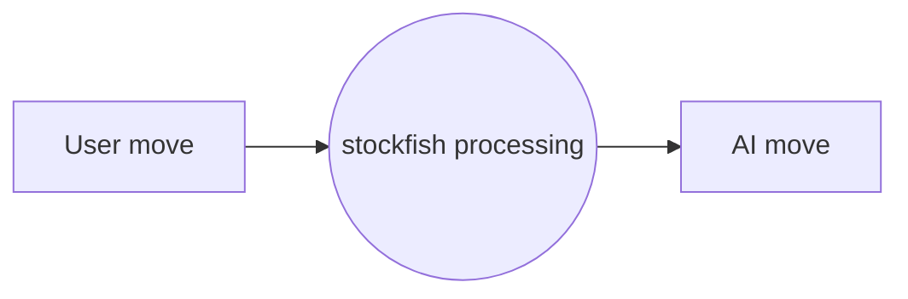

# CHESS API
A python-flask-based stockfish api that gives the best move for the corresponding user move in a chess game



## Endpoints

### GET /
    RETURNS a chess board to make moves online

### GET /api/?elo={elo}
    initializes the game. With difficulty set to the `elo` level
    default elo is 1200

    RETURNS game id and token "id", "token"

Use the id and token to access your game

### POST /api/{move}
    make user move in the game. Uses the from-square to-square format.
```json
{
  "id": 0,
  "token": 0,
  "move": "e2e4"
}
```
RETURNS
```json
{
  "id": 0,
  "token": 0,
  "move": "e2e4",
  "best_move": "e7e5"
}
```
If illegal move RETURNS
```json
{
  "id": 0,
  "token": 0,
  "illegal": true
}
```

### GET /api/state/{id}
    GET the current state of the game

```json
{
  "id": 0,
  "token": 0
}
```

RETURNS
```json
{
  "id": 0,
  "token": 0,
  "state": "playing",
  "moves": {
    "1": "e2e4",
    "2": "e7e5" 
  }
}
```
### PUT /api/{id}/resign
    resign the game

```json
{
  "id": 0,
  "token": 0
}
```
RETURNS
```json
{
    "id": 0,
    "token": 0,
    "state": "resigned"
}
```