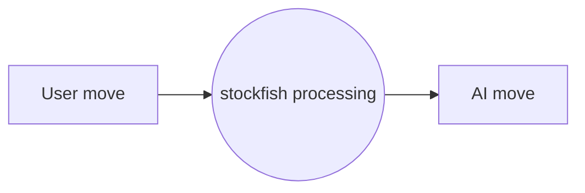

# CHESS API
A python-flask-based stockfish api that gives the best move for the corresponding user move in a chess game



 ## Endpoints

###  GET /
    RETURNS a chess board to make moves online

> Note
> Parameters inside [ ] are optional, and only one of them can be used at a time

### POST /api/robots/
Update robot availability

```json
{
  "sn": 1,
  "online": true,
  "status": ["STANDBY", "PLAYING"]
}
```

RETURNS
`200 OK`


###  GET /api/games/?sn={sn}&elo={elo}&player={[BLACK | WHITE]}
    initializes the game. With difficulty set to the `elo` level
    default elo is 1200.

    Sets up robot with sn = {sn} to play with the user.

    Sent from the mobile app

SENDS TO ROBOT
```json
{
  "id": 1,
  "token": "sbnsivnsidnvsiv",
  "elo": 1200,
  "player": ["BLACK", "WHITE"],
  "move" : [null, "e2e4"]
}
```

RETURNS TO MOBILE APP
```json
{
  "id": 1,
  "token": "sbnsivnsidnvsiv",
  "elo": 1200,
  "player": [
    "BLACK",
    "WHITE"
  ]
}
```
IF robot is not available
```json
{
  "error": "Robot not available"
}
```

Use the id and token to access your game

### POST /api/games/
    make user move in the game. Uses the from-square to-square format. Returns AI move.
```json
{
  "id": 0,
  "token": 0,
  "move": "e2e4"
}
```
RETURNS
```json
{
  "id": 0,
  "token": 0,
  "move": "e2e4",
  "stockfish_move": "e7e5"
}
```
If illegal move RETURNS
```json
{
  "id": 0,
  "token": 0,
  "move": "illegal",
  "state": "playing",
  "stockfish_move": null
}
```

### GET /api/games/{id}
    GET the current state of the game

RETURNS
```json
{
  "id": 0,
  "token": 0,
  "state": ["PLAYING", "STALEMATE", "GAME_OVER"],
  "board": "rnbqkbnr/pppppppp/8/8/8/8/PPPPPPPP/RNBQKBNR w KQkq - 0 1"
}
```
### DELETE /api/games/{id}?token={token}
    Resign from game. Sent from mobile app.
